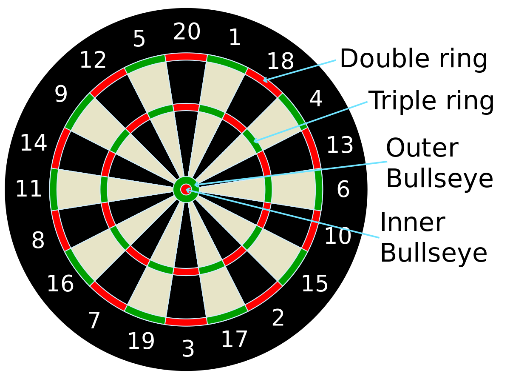

```{r setup, include=FALSE}
knitr::opts_chunk$set(echo = TRUE)
```

Zgodovina pikada je večstoletna. **Angleški kralj Henry VIII.** in **francoski kralj Karl VI.** sta že igrala pikado. Takratni pikado je bil nekaj med metanjem kopja in lokostrelstvom, moderni pikado pa se je razvil v angleških barih.


## Pikado tabla

Pikado tabla je krog razdeljen na 20 polj. Vrednost polja nam pove številka na obodu. Polja imajo vrednost od 1 do 20, dva majhna sredinska kroga pa imata vrednost 25 in 50 točk (veliki(outer) in mali(inner) bull). Na ozkih poljih, katera imajo dvojno ali trojno vrednost, pa se vrednost številke iz oboda podvoji oz. potroji.

```{r pressure, echo=FALSE, out.width = '50%'}

```

## Igra 301

Igra 301 pomeni, da imamo začetno vrednost 301 točk, katere moramo s puščicami "zapreti" na 0. V vsaki rundi imamo na voljo 3 mete puščice. Če z metom puščice pridemo na negativne točke (**bust**), se vrnemo na število točk pred začetkom runde. 

Oznaka **DO (double out)** pomeni, da moramo priti na 0 tako, da zadnjo puščico vržemo v polje z dvojno vrednostjo ali v središče. Torej če nam na koncu ostane npr. 40 lahko zaključimo z metom v dvakratno vrednost polja 20. *Pri implementaciji bomo zaradi preprostosti obravnavali igro brez DO.*

