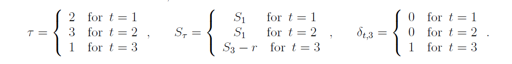

## Minimiziranje števila rund do zaključka igre

Označimo z $(S_t, t, S_1)$ stanje v katerem se lahko igralec nahaja. Parameter $S_t$ označuje število točk pred metom puščice, $S_1$ označuje število točk pred začetkom runde in parameter $t = 1,2,3$. Tako na primer (35,2,40) označuje stanje igralca pred metom druge puščice v rundi, kjer je pri metu prve puščice dobil 5 točk (40-35 = 5). Če bi igralec sedaj vrgel puščico v središče table in dobil 50 točk, bi se vrnil na stanje (40,1,40), ker bi prešel v negativno število točk. 

Vpeljimo še nekaj oznak: 

* $T$ število rund do zaključka igre (stanje točk = 0) 

* $E(T|S_t, t, S_1)$ pričakovano število rund do konca, če igralec igra po strategiji minimiziranja števila rund

* $Pr(r|p)$ verjetnost, da dobimo r točk, če ciljamo v točko $p \in D$ 

* $D$ množica točk na tabli

* $B$ množica rezultatov, ki nas pripelje v *bust* (če zadanemo $r \in B$ bo naše število točk negativno in se bomo vrnili na stanje pred začetkom runde)

Sedaj lahko pričakovano število rund do konca igre definiramo kot:
$$
E(T|S_t, t, S_1) = \min\limits_{p \in D} \Big( \sum_{r \in B} ( E(T|S_1,1,S_1) + 1)Pr(r|p) + \sum_{r=0}^{S_t-1} (E(T|S_t - r, \tau, S_{\tau}) + \delta_{t,3})Pr(r|p)) \Big),
$$
kjer so

Optimalna ciljna točka v stanju $(S_t,t, S_1)$ je točka $p$, ki minimizira zgornjo pričakovano vrednost. 

#### Implementacija
V zgornji enačbi potrebujemo za minimizacijo pričakovane vrednosti naslednjih rund, ki pa jih nimamo. Zato bomo vrednosti pridobili z **iterativnim algoritmom**. 

Vpeljimo naslednje oznake:

* $S' = (S'_t, t', S'_1)$ stanje po metu puščice

* $V(S) = E(T|S) = E(T|S_t, t, S_1)$

* $Pr(S'|S,p)$ prehod iz stanja $S$ v stanje $S'$, če ciljamo v točko $p$

* $C(S') = 1$, ko $t' = 1$ in $C(S')=0$, ko $t' = 2,3$ 

Sedaj lahko definiramo
$$
V(S) = \min_{p \in D} \Big(\sum_{S'}( \gamma V(S') + C(S'))Pr(S'|S,p)\Big).
$$

Enačba je znana kot *Bellmanova enačba*, v našem primeru pa je $\gamma = 1.$ Rešitev enačbe lahko aproksimiramo s pomočjo iterativnega algoritma, kjer najprej definiramo začetna stanja $V^0(S).$ Naslednje aproksimacije dobimo s povezavo
$$
V^{n+1}(S) = \min_{p\in D} \Big(\sum_{S'}( \gamma V^{n}(S') + C(S'))Pr(S'|S,p) \Big).
$$

Označimo z $V^{*}(S)$ rezultat iteracije. Najmanjša vrednost spodnje enačbe (glede na $p$)
$$
\Big(\sum_{S'}( \gamma V^{*}(S') + C(S'))Pr(S'|S,p) \Big)
$$
nam da približek za $E(T|S).$ Vrednost $p$, ki minimizira izraz, je naša **optimalna ciljna točka**. 
