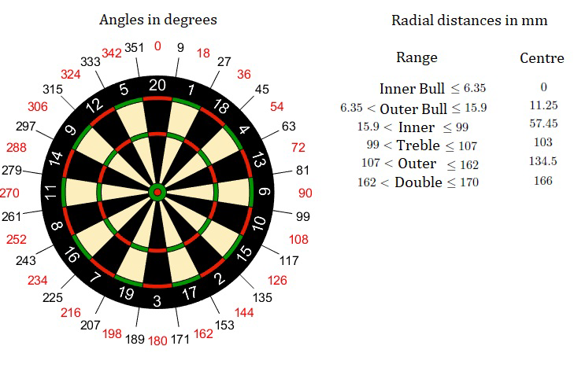
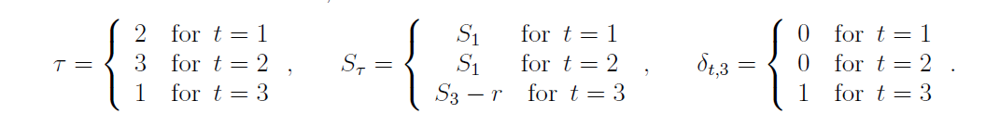

```{r setup, include=FALSE}
knitr::opts_chunk$set(echo = TRUE)
```

# Pikado 

## Program
Za zagon programa in shiny aplikacije je potrebno zagnati samo **datoteko `pikado.r`.**

S tem se zaženejo naslednje datoteke:

* osnovne funckije za igro pikada (tabla pikada, met puscice, točke):  `program/osnovne_funkcije.r`

* strategija 1 - maksimiziranje števila točk pri metu puščice:  `program/strategija1.r` 

* strategija 2 - minimziranje potrebnih rund do konca igre:  `program/strategija2.r`

* aplikacija shiny:  `shiny/server.r` in `shiny/ui.r`


## Namen
Cilj je analizirati optimalno strategijo pri igri pikada v odvisnosti od porazdelitve "puščice", to je od natančnostni igralca.

## Pravila igre pikada 301
Pikado tabla je krog razdeljen na 20 polj. Vrednost polja nam pove številka na obodu. Polja imajo vrednost od 1 do 20, dva majhna sredinska kroga pa imata vrednost 25 in 50 točk (veliki(outer) in mali(inner) bull). Na ozkih poljih, katera imajo dvojno ali trojno vrednost, pa se vrednost številke iz oboda podvoji oz. potroji.

Igra 301 pomeni, da imamo začetno vrednost 301 točk, katere moramo s puščicami "zapreti" na 0. Če z metom puščice pridemo na negativne točke, se vrnemo na število točk pred začetkom runde. Oznaka DO (double out) pomeni, da moramo priti na 0 tako, da zadnjo puščico vržemo v polje z dvojno vrednostjo ali v središče. Torej če nam na koncu ostane npr. 40 lahko zaključimo z metom v dvakratno vrednost polja 20. *Pri implementaciji bomo zaradi preprostosti obravnavali igro brez DO.* 

## Matematično ozadje
Za zmago v igri 301 je potrebno čim hiteje spraviti točke na nič, zato je na začetku igre optimalna strategija maksimiziranje števila točk z metom puščice. Proti zaključevanju igre pa to ni več optimalna strategija, saj lahko pridemo na negativno število točk in zapravimo našo rundo. Takrat bo optimalna strategija tista, ki bo minizirala število rund do zaključka igre. 

Na začetku sprejmemo nekaj predpostavk:

* širino žic, ki ločujejo polja na realni pikado tabli ignoriramo

* met puščice je porazdeljen s porazdelitvijo dvorasežne normalne z neodvisnima komponentama s parametroma $(\mu_{x}, \mu_{y})$ - ciljna točka in $(\sigma_{x}, \sigma_{y})$ - natančnost igralca

* meti so neodvisni

Pri implementaciji si pomagamo z meritvami na sliki:
```{r pressure, echo=FALSE, out.width = '100%'}

```

### Optimalna strategija 1: maksmiziranje števila točk
Met puščice ima gostoto

$$
p(x,y) = \frac{1}{2\pi \sigma_{x} \sigma_{y}} exp \Big( - \frac{(x-\mu_{x})^2}{2\sigma_{x}^2} - \frac{(y-\mu_{y})^2}{2\sigma_{y}^2}\Big).
$$

Naj bo $S$ število točk, ki jih je igralec dosegel z metom puščice in $d(x,y)$ funkcija, ki pretvori koordinate meta v število točk. Potem lahko pričakovano vrednost točk pri metu puščice v ciljno točko $(\mu_{x}, \mu_{y})$ glede na natančnost igralca definiramo kot:

$$
E(S|\mu_{x}, \mu_{y}, \sigma_{x}, \sigma_{y}) = E(d(x,y)|\mu_{x}, \mu_{y}, \sigma_{x}, \sigma_{y}) = \iint_D d(x,y) p(x,y) dxdy,
$$

kjer je $D$ označuje območje polja na tabli.

Zanima nas, v katero točko moramo ciljati glede na naš nivo natančnosti, da dosežemo največ točk v enem metu. 

#### Implementacija
Idejo implementiramo s pomočjo **metode Monte Carlo**. Tablo razdelimo na mrežo točk $(\mu_{x}^{n}, \mu_{y}^{m}),$ kjer je $\mu_x^n = n\Delta$, $\mu_x^m = m\Delta, \Delta = 170/N$ mm (N poljubno veliko število) in 

$$
m, n \in \{ -N, \dots, -1,0,1, \dots, N| n^2 + m^2 \leq N^2\}.
$$

V vsaki točki izračunamo zgornjo pričakovano vrednost. Točka pri kateri je pričakovana vrednost največja je **optimalna ciljna točka** pri natančnosti $(\sigma_{x}, \sigma_{y})$ in dosežena  vrednost je **optimalno številko točk**.
Integral s katerim dobimo pričakovano vrednost pa prav tako izračunamo s pomočjo metode Monte Carlo.

### Optimalna strategija 2: minimiziranje števila rund do zaključka igre
Označimo z $(S_t, t, S_1)$ stanje v katerem se lahko igralec nahaja. Parameter $S_t$ označuje število točk pred metom puščice, $S_1$ označuje število točk pred začetkom runde in parameter $t = 1,2,3$. Tako na primer (35,2,40) označuje stanje igralca pred metom druge puščice v rundi, kjer je pri metu prve puščice dobil 5 točk (40-35 = 5). Če bi igralec sedaj vrgel puščico v središče table in dobil 50 točk, bi se vrnil na stanje (40,1,40), ker bi prešel v negativno število točk. 

Vpeljimo še nekaj oznak: 

* $T$ število rund do zaključka igre (stanje točk = 0) 

* $E(T|S_t, t, S_1)$ pričakovano število rund do konca, če igralec igra po strategiji minimiziranja števila rund

* $Pr(r|p)$ verjetnost, da dobimo r točk, če ciljamo v točko $p \in D$ 

* $D$ množica točk na tabli

* $B$ množica rezultatov, ki nas pripelje v *bust* (če zadanemo $r \in B$ bo naše število točk negativno in se bomo vrnili na stanje pred začetkom runde)

Sedaj lahko pričakovano število rund do konca igre definiramo kot:
$$
E(T|S_t, t, S_1) = \min\limits_{p \in D} \Big( \sum_{r \in B} ( E(T|S_1,1,S_1) + 1)Pr(r|p) + \sum_{r=0}^{S_t-2} (E(T|S_t - r, \tau, \S_{\tau}) + \delta_{t,3})Pr(r|p)) \Big),
$$
kjer so

```{r, echo=FALSE, out.width = '100%'}

```

Optimalna ciljna točka v stanju $(S_t,t, S_1)$ je točka $p$, ki minimizira zgornjo pričakovano vrednost. 

#### Implementacija
V zgornji enačbi potrebujemo za minimizacijo pričakovane vrednosti naslednjih rund, ki pa jih nimamo. Zato bomo vrednosti pridobili z **iterativnim algoritmom**. 

Vpeljimo naslednje oznake:

* $S' = (S_t^{'}, t', S_1^{'})$ stanje po metu puščice

* $V(S) = E(T|S) = E(T|S_t, t, S_1)$

* $Pr(S'|S,p)$ prehod iz stanja $S$ v stanje $S'$, če ciljamo v točko $p$

* $C(S') = 1$, ko $t' = 1$ in $C(S')=0$, ko $t' = 2,3$ 

Sedaj lahko definiramo
$$
V(S) = \min_{p \in D} \Big(\sum_{S'}( \gamma V(S') + C(S'))Pr(S'|S,p)\Big).
$$

Enačba je znana kot *Bellmanova enačba*, v našem primeru pa je $\gamma = 1.$ Rešitev enačbe lahko aproksimiramo s pomočjo iterativnega algoritma, kjer najprej definiramo začetna stanja $V^0(S).$ Naslednje aproksimacije dobimo s povezavo
$$
V^{n+1}(S) = \min_{p\in D} \Big(\sum_{S'}( \gamma V^{n}(S') + C(S'))Pr(S'|S,p) \Big).
$$

Označimo z $V^{*}(S)$ rezultat iteracije. Najmanjša vrednost spodnje enačbe (glede na $p$)
$$
\Big(\sum_{S'}( \gamma V^{*}(S') + C(S'))Pr(S'|S,p) \Big)
$$
nam da približek za $E(T|S).$ Vrednost $p$, ki minimizira izraz, je naša **optimalna ciljna točka**. 

